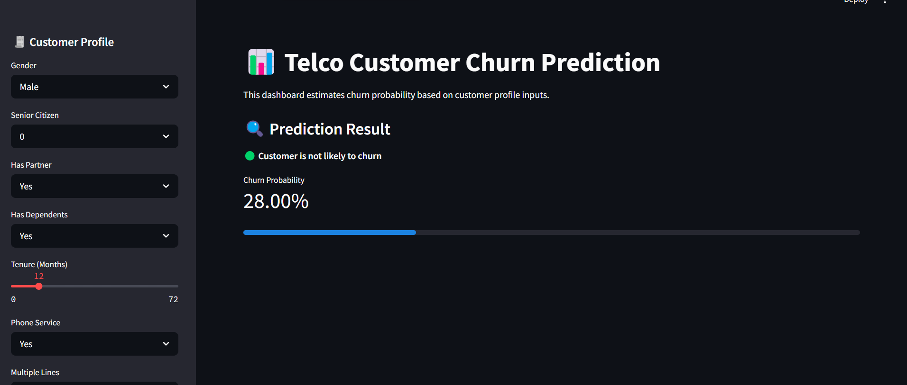
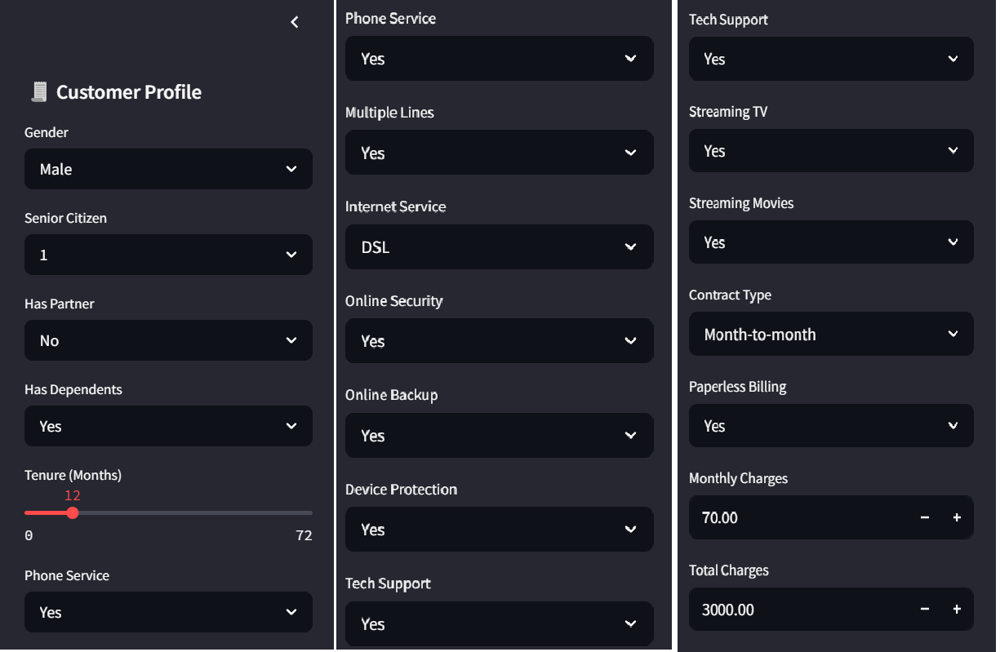
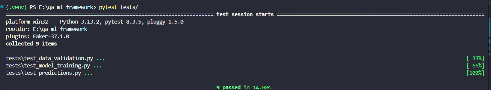

# 🧲 QA ML Automation Framework


A CI/CD-integrated QA automation framework for validating machine learning pipelines — including data validation, model training reproducibility, prediction testing, and interactive real-time inference. Built with PyTest, YAML configs, and GitHub Actions for seamless testing and deployment. The system is now extended with a full-featured Streamlit dashboard for user interaction and churn prediction.

---

## 📌 Features

- ✅ YAML-configurable test setup
- 🧪 PyTest-based test suite for data, training, and predictions
- 📋 Accuracy threshold & reproducibility testing
- 🧾 Streamlit-based user input dashboard
- 📁 Modular code: `scripts/`, `tests/`, `configs/`
- 🔀 Fully integrated with GitHub Actions for CI automation
- 💾 Synthetic + real-world dataset support (Telco Customer Churn)
- 📊 Interactive UI layout inspired by Power BI / Tableau

---

## 💠 Tech Stack

- Python 3.10+
- PyTest
- scikit-learn
- Pandas
- YAML
- Faker
- GitHub Actions (CI)
- Streamlit
- Joblib

---

## 📂 Project Structure

```bash
qa-ml-automation-framework/
├── configs/
│   └── test_config.yaml
├── data/
│   └── Telco_Customer_Churn.csv
├── models/
│   ├── model.pkl
│   └── feature_names.pkl
├── scripts/
│   ├── train.py
│   ├── predict.py
│   └── generate_data.py
├── tests/
│   ├── test_data_validation.py
│   ├── test_model_training.py
│   └── test_predictions.py
├── app.py
├── .github/workflows/
│   └── ci.yml
├── requirements.txt
├── README.md
└── LICENSE
```

---

## 🚀 Getting Started

```bash
# Clone repo
git clone https://github.com/DarSahran/qa-ml-automation-framework.git
cd qa-ml-automation-framework

# Setup virtual environment
python -m venv .venv
.\.venv\Scripts\activate  # Windows
# or
source .venv/bin/activate  # macOS/Linux

# Install dependencies
pip install -r requirements.txt

# Train model and save feature names
python scripts/train.py

# Run tests
pytest tests/

# Launch dashboard
streamlit run app.py
```

---

## 🧠 Dataset Description

This project uses the **Telco Customer Churn Dataset** — a real-world dataset from IBM, designed to analyze and predict customer churn.

**Key Features:**
- `Churn`: Whether the customer left the service (target label)
- `Services`: Phone, internet, backup, streaming, support, etc.
- `Account`: Tenure, contract type, monthly charges, payment method
- `Demographics`: Gender, dependents, senior status, etc.

📌 Source: [IBM Sample Dataset - Telco Churn](https://community.ibm.com/community/user/businessanalytics/blogs/steven-macko/2019/07/11/telco-customer-churn-1113)

Use case: Predict behavior to retain customers, and analyze churn patterns using explainable ML.

---


## 📷 Sample Dashboard Views

### 🔮 Dashboard Prediction Output


### 📋 Sidebar Input Controls
 

### ✅ CI/CD Test Validation
 

## 📈 CI/CD Automation

This framework automatically runs the full test suite on every push and pull request via GitHub Actions.

---

## 👨‍💻 Author

**Sahran Altaf**  
GitHub: [@DarSahran](https://github.com/DarSahran)  
LinkedIn: [SahranAltaf](https://www.linkedin.com/in/SahranAltaf)
